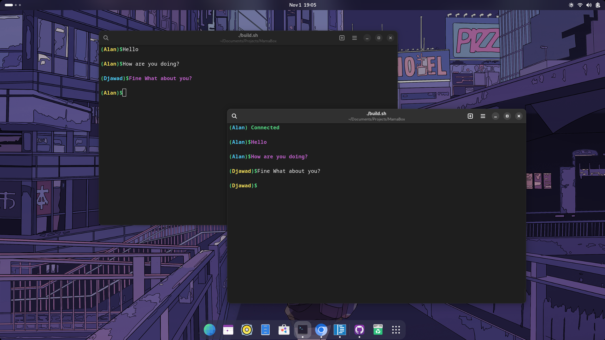

# UDP BASE CHAT BOX WRITTEN IN PURE C
- Note this works just in LINUX/UNIX-LIKE SYSTEMS(FREEBSD...)

## Screenshot:


## Time:
- Started       31/10/2023 11:00 PM
- Finished      01/11/2023 06:30 PM (still writing this READMI)

## Features:
- No dependencies.
- MuliClients (Up to 32 client!).
- Plug and Play.
- Enjot it.

## Note:
- I decided to make a Game then I see that enven the server is over kill so i stop.
- I did not use the heap, as I do not want to debug segmentaion faults
- I use simple model

    ```
                         ---------------
                        |               |
                        |               |
        Chat/Game ======|  Net_Handler  |====== Server/Client UDP communication
                        |               |
                        |               |
                         ---------------
    ```
- Note as I thout a lot about the implementation I add some comments that doas not make a sense

## Install / Run:
- run `./build.sh` and every thing will be fine.


## Licence:
- BIGMAMA/DxUr I dont know this is not a program this is just a test